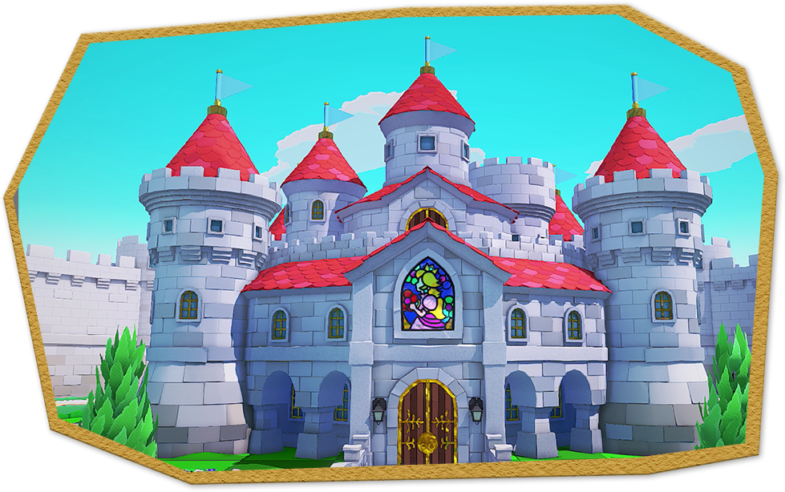
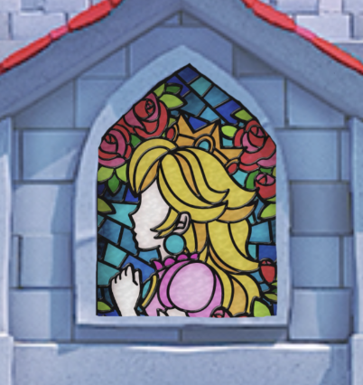
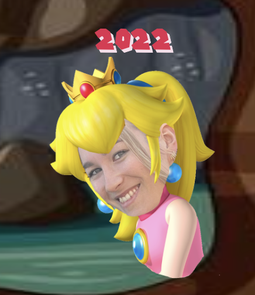
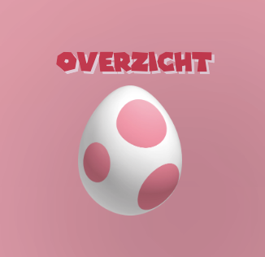
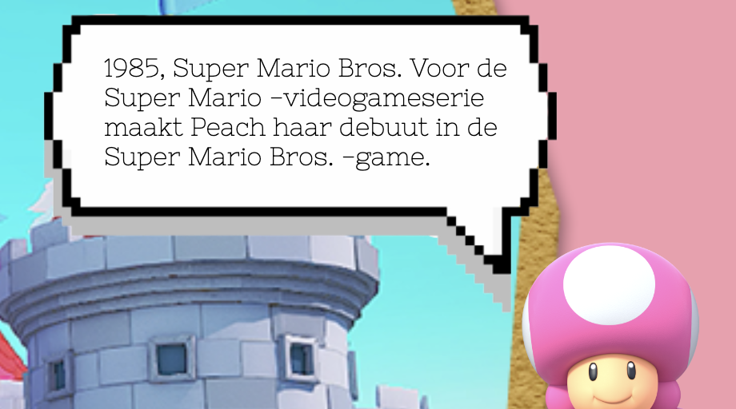
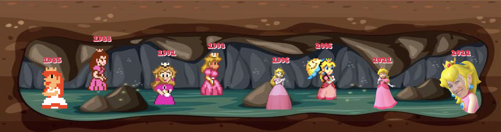

# Procesverslag
Markdown is een simpele manier om HTML te schrijven.  
Markdown cheat cheet: [Hulp bij het schrijven van Markdown](https://github.com/adam-p/markdown-here/wiki/Markdown-Cheatsheet).

Nb. De standaardstructuur en de spartaanse opmaak van de README.md zijn helemaal prima. Het gaat om de inhoud van je procesverslag. Besteedt de tijd voor pracht en praal aan je website.

Nb. Door *open* toe te voegen aan een *details* element kun je deze standaard open zetten. Fijn om dat steeds voor de relevante stuk(ken) te doen.

## Jij

### Ontwerper:
Yentl Reus

#### Je startniveau:
Mijn startniveau is blauw

# Je plan

  
Deze opdracht is een mega uitdaging voor mij. Dit aangezien ik nog nooit in mijn leven eerder heb gewerkt met code. Als ik een werkend design heb neergezet denk ik dat 

  ### De eerste versie/schets:
  

  ### Je ambitie: 
  Aan deze technieken/punten wil ik werken:
  - Code kunnen begrijpen
  - Website werkend maken
  - De "basics" onder de knie krijgen
  
 

## Voortgang/Feedback 1

  
Mijn bevindingen + wijzigingen (Carmen)

  ### Bevinding 1:
  "Kijk wel even naar de achtergrond of die een wat hogere resolutie kan krijgen."
  

  #### oplossing:
  Uiteindelijk bleek de achtergrond ook niet geschikt te zijn om het design responsive te maken. Daarom heb ik gekozen voor een andere kleinere afbeelding die scherper is. 
  

  ### Bevinding 2:
  Waar plaats je de informatie? Misschien scherm 3/4 vullen en dan de overige ruimte hiervoor gebruiken. Of iets aan de onderkant laten uitklappen. (progressive disclosure). Of de informatie laten zien op het kasteel zelf?

  #### oplossing:
  Ik heb er voor gekozen om aan de zijkant een stuk perkament te plaatsten waar de informatie op terecht komt. Toad verteld als het ware wat er staat net zoals in de game gebeurd. 

 

  ### Bevinding 3:
  Welke besturing ga je gebruiken? Ik denk dat pijltjestoetsen hierbij wel leuk is.

  #### oplossing:
  Ik heb er voor geklozen om het raam de navigatie te laten zijn. Zelf vond ik dit een creatieve en originele manier en weer eens anders dan de pijltjestoetsen. Wanneer je over het raam heen hovert licht hij op om de gebruiker duidelijk te maken dat je er op kunt klikken. Ook het openingsbericht geeft aan dat de gebruiker op het magische raam moet klikken om te starten. 

   

## Voortgang/Feedback 2

  
Mijn bevindingen + wijzigingen (Noa)

  
  ### Bevinding 1:
  Misschien kan je bedenken waar je een easteregg kan plaatsen.

  #### oplossing:
  Als grapje/easteregg heb ik mijzelf als de nieuwste versie van peach neergezet. 
  
  
  

  ### Bevinding 2:
  Maak de jaartallen wat groter zodat ze beter te lezen zijn.

  #### oplossing:
  Jaartallen groter gemaakt en schaduw toegevoegd voor meer contrast en betere leesbaarheid. Ik heb hier helaas geen "before" foto van maar eerst was de tekst de helfd kleiner zonder schaduw.

  ### Bevinding 3:
  ...

## Voortgang/Feedback 3

  
Mijn bevindingen + wijzigingen (Tessa)

  
  ### Bevinding 1:
  Zorg dat de emoij regen stopt want dit leidt af van de interface.

  #### oplossing:
  Ik was het hier helemaal mee eens. Ik wilde dat de regen na 1 keer vallen stopte. Uiteindelijk na veel zoeken en proberen heb ik toch Sanne moeten vragen aangezien het niet lukte. Hij heeft toen vervolgens iets met if, this, else en remove gedaan en toen was het gefixt! De regen valt nu 1 keer bij het landen op de pagina als welkom, daarna is het weg en is alle aandacht bij de interface. 

  ### Bevinding 2:
  Voeg wat meer tekst toe. 

  #### oplossing:
  Toad vertelde eerst alleen welk jaartal en spel er hoorde bij de peach die in de deur stond. Nu heb ik daar een extra stukje over de game bijgevoegd voor wat meer context. 
  

  ### Bevinding 3:
  Haal het zwarte vlak beneden weg. 

  #### oplossing:
  Ik heb even moeten uitzoeken welk van de afbeeldingen te groot was waardoor de zwart ruimte zichtbaar was. Uiteindelijk bleek dat mijn "eigen" peach te zijn. Daarom heb ik de randen van deze foto even afgesneden en opnieuw geplaatst. Hierdoor verdween de zwarte ruimte. 

## Reflectie

  
Mijn eindresultaat & persoonlijke ontwikkeling

  ### Je uitkomst - karakteristiek screenshot(s):
  
  

  ### Dit ging goed/Heb ik geleerd: 
  In principe letterlijk alles wat je in de code en interface kunt zien (haha). Van de volgorde en termen van HTML tot het opmaken in CSS. Ik heb ook Javascript gebruikt al heb ik daar veel hulp voor gehad. Ik begrijp nu wat er ongeveer staat maar zelf ben ik deze taal nog niet zo vaardig als ik HTML en CSS nu ben. Ik heb geleerd hoe ik elementen maak, verplaats en opmaak maar ook hoe ik animeer en states toevoeg. Toch denk ik dat het meest waardevolle wat ik heb geleerd de taal opzich is. Ik begrjp de basics en kan overleggen met developers (en wat ze mee maken tijdens coderen)

  ### Dit was lastig/Is niet gelukt:
  Alles is lastig als je niet weet hoe het moet. Door veel te vragen, te kijken en te zoeken heb ik uiteindelijk op dat moment begrepen wat er gebeurde. Moet ik sommige dingen nu zelf opnieuw gaan doen, denk ik dat ik het weer lastig vind zoals de eerste keer. Ik heb nu wel een voorbeeld die ik in de toekomst erbij kan pakken om te kijken hoe ik nu verschillende elementen heb gemaakt. 

  

## Bronnenlijst

continu bijhouden terwijl je werkt

Nb. Wees specifiek ('css-tricks' als bron is bijv. niet specifiek genoeg).

1. MarioWiki https://www.mariowiki.com/Princess_Peach#Super_Princess_Peach
2. bron 2
3. ...

