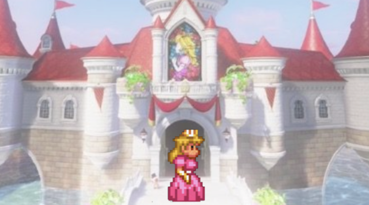
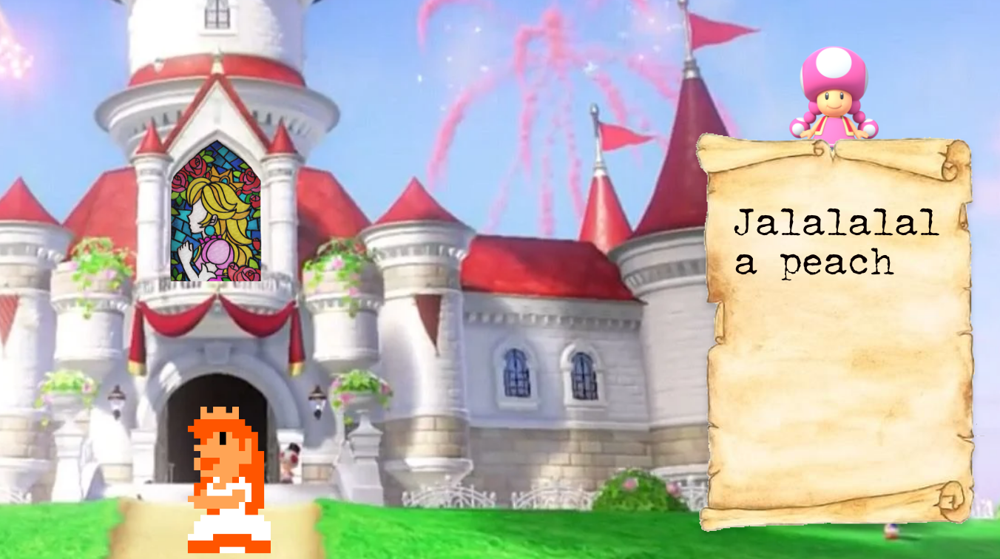

# Procesverslag
Markdown is een simpele manier om HTML te schrijven.  
Markdown cheat cheet: [Hulp bij het schrijven van Markdown](https://github.com/adam-p/markdown-here/wiki/Markdown-Cheatsheet).

Nb. De standaardstructuur en de spartaanse opmaak van de README.md zijn helemaal prima. Het gaat om de inhoud van je procesverslag. Besteedt de tijd voor pracht en praal aan je website.

Nb. Door *open* toe te voegen aan een *details* element kun je deze standaard open zetten. Fijn om dat steeds voor de relevante stuk(ken) te doen.

## Jij

### Ontwerper:
Yentl Reus

#### Je startniveau:
Mijn startniveau is blauw

# Je plan

  
Deze opdracht is een mega uitdaging voor mij. Dit aangezien ik nog nooit in mijn leven eerder heb gewerkt met code. Als ik een werkend design heb neergezet denk ik dat 

  ### De eerste versie/schets:
  

  ### Je ambitie: 
  Aan deze technieken/punten wil ik werken:
  - Code kunnen begrijpen
  - Website werkend maken
  - De "basics" onder de knie krijgen
  
 

## Voortgang/Feedback 1

  
Mijn bevindingen + wijzigingen (minimaal 5)

  ### Bevinding 1:
  "Kijk wel even naar de achtergrond of die een wat hogere resolutie kan krijgen."
  

  #### oplossing:
  Uiteindelijk bleek de achtergrond ook niet geschikt te zijn om het design responsive te maken. Daarom heb ik gekozen voor een andere kleinere afbeelding die scherper is. 
 

  ### Bevinding 2:
  Waar plaats je de informatie? Misschien scherm 3/4 vullen en dan de overige ruimte hiervoor gebruiken. Of iets aan de onderkant laten uitklappen. (progressive disclosure). Of de informatie laten zien op het kasteel zelf?
  

  #### oplossing:
  Ik heb er voor gekozen om aan de zijkant een stuk perkament te plaatsten waar de informatie op terecht komt. 

  ### Bevinding 3:
  Welke besturing ga je gebruiken? Ik denk dat pijltjestoetsen hierbij wel leuk is.
  
  #### oplossing: 
  Ik heb er voor gekozen om de navigatie via het raam te laten gaan. 

## Voortgang/Feedback 2

  
Mijn bevindingen + wijzigingen (minimaal 5)

  
  ### Bevinding 1:
  Omschrijving van wat er nog niet orde was (tekst en afbeeding(en)).

  #### oplossing:
  Beschrijving hoe je het hebt hebt opgelost of als het niet gelukt is hoe je het zou oplossen (tekst en afbeeding(en)).

  ### Bevinding 2:
  Omschrijving van wat er nog niet orde was (tekst en afbeeding(en)).

  #### oplossing:
  Beschrijving hoe je het hebt hebt opgelost of als het niet gelukt is hoe je het zou oplossen (tekst en afbeeding(en)).

  ### Bevinding 3:
  ...

## Voortgang/Feedback 3

  
Mijn bevindingen + wijzigingen (minimaal 5)

  
  ### Bevinding 1:
  Zorg dat de emoij regen stopt want dit leidt af van de interface.

  #### oplossing:
  Beschrijving hoe je het hebt hebt opgelost of als het niet gelukt is hoe je het zou oplossen (tekst en afbeeding(en)).

  ### Bevinding 2:
  Voeg wat meer tekst toe. 

  #### oplossing:
  Beschrijving hoe je het hebt hebt opgelost of als het niet gelukt is hoe je het zou oplossen (tekst en afbeeding(en)).

  ### Bevinding 3:
  Haal het zwarte vlak beneden weg. 

## Reflectie

  
Mijn eindresultaat & persoonlijke ontwikkeling
!

  ### Je uitkomst - karakteristiek screenshot(s):
    [Uploading Schermafbeelding 2022-04-26 om 14.01.11.png…]()

  ### Dit ging goed/Heb ik geleerd: 
  Korte omschrijving met plaatje(s)

  

  ### Dit was lastig/Is niet gelukt:
  Korte omschrijving met plaatje(s)

  

## Bronnenlijst

continu bijhouden terwijl je werkt

Nb. Wees specifiek ('css-tricks' als bron is bijv. niet specifiek genoeg).

1. MarioWiki https://www.mariowiki.com/Princess_Peach#Super_Princess_Peach
2. bron 2
3. ...

